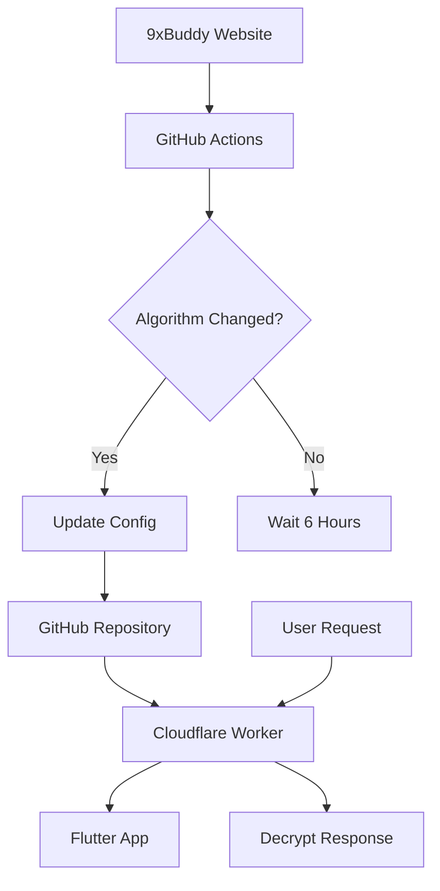

# 🔓 Dynamic 9xBuddy Decrypt System
[](https://github.com/masa2146/9xbuddy-algorithm-detector/actions)
[](https://opensource.org/licenses/MIT)
[](https://workers.cloudflare.com/)
[](https://flutter.dev/)

**Dinamik ve sürdürülebilir 9xBuddy URL şifre çözme sistemi** - Algorithm değişikliklerini otomatik tespit eden ve güncelleyen production-ready çözüm.

## 🎯 Özellikler

- 🤖 **Otomatik Algorithm Tespiti**: GitHub Actions ile 6 saatte bir kontrol
- ☁️ **Cloudflare Workers API**: Yüksek performanslı decrypt servisi
- 📱 **Flutter Ready**: Mobile app entegrasyonu hazır
- 🔄 **Dinamik Güncelleme**: Algorithm değişse bile çalışmaya devam eder
- 💰 **Tamamen Ücretsiz**: GitHub Actions + Cloudflare Workers free tier
- 🛡️ **Production Ready**: Error handling, caching, monitoring

## 🚀 Quick Start

### 1. Repository'yi Fork Edin

```bash
git clone https://github.com/YOUR-USERNAME/dynamic-9xbuddy-decrypt.git
cd dynamic-9xbuddy-decrypt
```

### 2. Cloudflare Worker'ı Deploy Edin

```bash
# Wrangler CLI kurulumu
npm install -g wrangler

# Cloudflare'e login
wrangler login

# Worker'ı deploy et
cd cloudflare-worker
wrangler deploy
```

### 3. GitHub Actions'ı Aktif Edin

Repository ayarlarından Actions'ı etkinleştirin. İlk çalıştırma otomatik olarak yapılacak.

### 4. API'yi Test Edin

```bash
# Health check
curl https://your-worker-name.workers.dev/health

# Config kontrolü
curl https://your-worker-name.workers.dev/config
```

## 📚 API Kullanımı

### 🔧 Endpoints

| Endpoint | Method | Açıklama |
|----------|--------|----------|
| `/config` | GET | Mevcut algorithm bilgisi |
| `/decrypt` | POST | Tek URL şifre çözme |
| `/batch-decrypt` | POST | Çoklu URL şifre çözme |
| `/health` | GET | Sistem durumu kontrolü |

### 💻 Tek URL Şifre Çözme

```bash
curl -X POST https://your-worker.workers.dev/decrypt \
  -H "Content-Type: application/json" \
  -d '{
    "encryptedUrl": "3d41713266583672576571733971617170657068696e4a6c624e39316d4f7034774f3256637274755061397834794d32584850595137737a7a53706476796f68326457696e4f4b706f6d70636975717279744b704a725a70555064596c7171777642347a476a4c752b4b4962",
    "token": "aZiQbmWWY2xhcXCeqaWko21jk22tk6aSlade1suqnKeZqqKmnmVmZGpeY2KUYmVRhI+Xj6LMkWtqm19raWlqZ2U="
  }'
```

**Response:**
```json
{
  "success": true,
  "data": {
    "originalUrl": "3d41713266...",
    "decryptedUrl": "//offmp3.net/process?url=https%3A%2F%2Fwww.youtube.com%2Fwatch%3Fv%3Dx7HA9KJKniU",
    "timestamp": "2024-01-15T14:30:00.000Z",
    "version": "2024.01.15.1430"
  }
}
```

### 📦 Çoklu URL Şifre Çözme

```bash
curl -X POST https://your-worker.workers.dev/batch-decrypt \
  -H "Content-Type: application/json" \
  -d '{
    "formats": [
      {
        "quality": "Audio",
        "type": "audio",
        "ext": "mp3",
        "url": "3d41713266583672..."
      },
      {
        "quality": "480p",
        "type": "video", 
        "ext": "mp4",
        "url": "3d3d516d43364c78..."
      }
    ],
    "token": "aZiQbmWWY2xhcXCe..."
  }'
```

## 🏗️ Sistem Mimarisi



### 🔄 Algorithm Detection Flow

1. **GitHub Actions** her 6 saatte bir çalışır
2. **9xBuddy'nin JS dosyalarını** analiz eder
3. **Algorithm değişikliği** tespit ederse:
   - Config dosyasını günceller
   - History kaydı oluşturur
   - GitHub Issue açar
4. **Cloudflare Worker** güncel config'i kullanır

## 🛠️ Geliştirme

### Local Development

```bash
# Dependencies kurulumu
npm install

# Algorithm detection test
npm run detect

# Worker'ı local test
cd cloudflare-worker
wrangler dev
```

### Project Structure

```
├── .github/
│   ├── workflows/
│   │   └── detect-algorithm-changes.yml    # GitHub Actions workflow
│   └── scripts/
│       └── detect-algorithm.js             # Algorithm detection script
├── config/
│   ├── algorithm.json                      # Current algorithm config
│   └── history.json                        # Change history
├── cloudflare-worker/
│   ├── worker.js                          # Main worker script
│   └── wrangler.toml                      # Wrangler configuration
├── package.json
└── README.md
```

## 🔍 Algorithm Detection

### Nasıl Çalışır?

1. **Web Scraping**: 9xBuddy'nin ana sayfasını analiz eder
2. **JS Analysis**: JavaScript dosyalarında decrypt fonksiyonunu arar
3. **Pattern Matching**: Algorithm parametrelerini çıkarır
4. **Change Detection**: Mevcut config ile karşılaştırır
5. **Auto Update**: Değişiklik varsa otomatik günceller

### Tespit Edilen Parametreler

- **Static String**: Şifreleme anahtarındaki sabit string
- **CSS Hash**: CSS dosyasından çıkarılan hash değeri
- **Hostname Length**: Domain uzunluğu
- **Decrypt Function**: Şifre çözme algoritması
- **Endpoints**: API endpoint'leri

## 📱 Flutter Entegrasyonu

### HTTP Client Örneği

```dart
class BuddyDecryptService {
  static const String baseUrl = 'https://your-worker.workers.dev';
  
  Future<String> decryptUrl(String encryptedUrl, String token) async {
    final response = await http.post(
      Uri.parse('$baseUrl/decrypt'),
      headers: {'Content-Type': 'application/json'},
      body: json.encode({
        'encryptedUrl': encryptedUrl,
        'token': token,
      }),
    );
    
    if (response.statusCode == 200) {
      final data = json.decode(response.body);
      return data['data']['decryptedUrl'];
    }
    
    throw Exception('Decrypt failed');
  }
}
```

### Batch Processing

```dart
Future<List<VideoFormat>> decryptFormats(
  List<VideoFormat> formats, 
  String token
) async {
  final response = await http.post(
    Uri.parse('$baseUrl/batch-decrypt'),
    headers: {'Content-Type': 'application/json'},
    body: json.encode({
      'formats': formats.map((f) => f.toJson()).toList(),
      'token': token,
    }),
  );
  
  final data = json.decode(response.body);
  return data['data']['results']
      .map<VideoFormat>((item) => VideoFormat.fromJson(item))
      .toList();
}
```

## 🔧 Konfigürasyon

### Worker Ayarları

`cloudflare-worker/wrangler.toml` dosyasında:

```toml
name = "buddy-decrypt-api"
main = "worker.js"
compatibility_date = "2024-01-15"

[limits]
cpu_ms = 50  # CPU limit
```

### GitHub Actions Ayarları

`.github/workflows/detect-algorithm-changes.yml` dosyasında:

```yaml
on:
  schedule:
    - cron: '0 */6 * * *'  # Her 6 saatte bir
  workflow_dispatch:        # Manuel çalıştırma
```

## 🚨 Monitoring & Alerts

### Health Check

```bash
curl https://your-worker.workers.dev/health
```

**Response:**
```json
{
  "success": true,
  "data": {
    "status": "healthy",
    "configVersion": "2024.01.15.1430",
    "configAge": 3600,
    "isConfigStale": false
  }
}
```

### GitHub Issue Alerts

Algorithm değişikliği tespit edildiğinde otomatik GitHub Issue oluşturulur:

- 🏷️ **Labels**: `algorithm-change`, `automated`
- 📅 **Timestamp**: Değişiklik zamanı
- 🔗 **Workflow Link**: GitHub Actions run linki

## 📊 Performance & Limits

### Cloudflare Workers (Free Tier)
- **100,000 requests/day**
- **10ms CPU time per request**
- **Global CDN distribution**
- **Sub-millisecond response times**

### GitHub Actions (Free Tier)
- **2,000 minutes/month**
- **Detection runs ~2 minutes**
- **~720 runs/month capacity**

## 🛡️ Security

- ✅ **CORS Configuration**: Cross-origin requests desteklenir
- ✅ **Input Validation**: Tüm girişler validate edilir
- ✅ **Error Handling**: Güvenli error responses
- ✅ **No Data Storage**: Kullanıcı verisi saklanmaz
- ✅ **Open Source**: Kod tamamen açık

## 🤝 Katkıda Bulunma

1. **Fork** the repository
2. **Create** a feature branch (`git checkout -b feature/amazing-feature`)
3. **Commit** your changes (`git commit -m 'Add amazing feature'`)
4. **Push** to the branch (`git push origin feature/amazing-feature`)
5. **Open** a Pull Request

### Development Guidelines

- ES6+ syntax kullanın
- JSDoc comments ekleyin
- Error handling dahil edin
- Unit tests yazın
- Best practices takip edin

## 📄 License

Bu proje MIT lisansı altında yayınlanmıştır. Detaylar için [LICENSE](LICENSE) dosyasına bakınız.

## 🙏 Acknowledgments

- **9xBuddy Team** - Orijinal algoritma geliştirme
- **Cloudflare** - Ücretsiz Workers platform
- **GitHub** - Actions ve hosting
- **Open Source Community** - İlham ve destek


## 📈 Status

- ✅ **Algorithm Detection**: Çalışıyor
- ✅ **Cloudflare Worker**: Deploy edildi
- ✅ **API Endpoints**: Test edildi
- 🔄 **Flutter SDK**: Geliştirme aşamasında
- 🔄 **Rate Limiting**: Planlı
- 🔄 **Analytics**: Planlı

---
